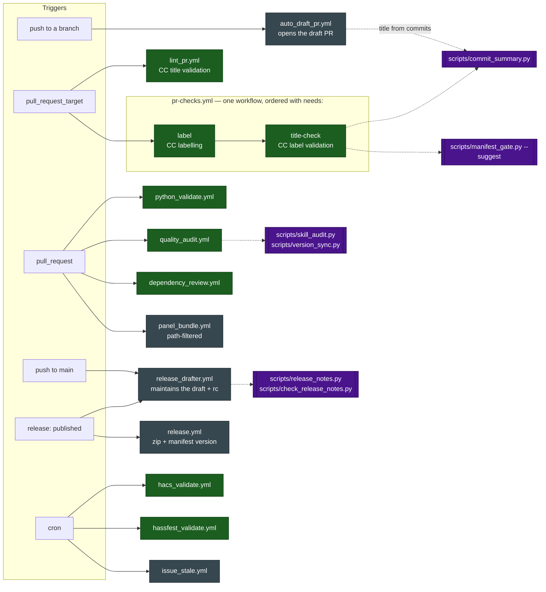
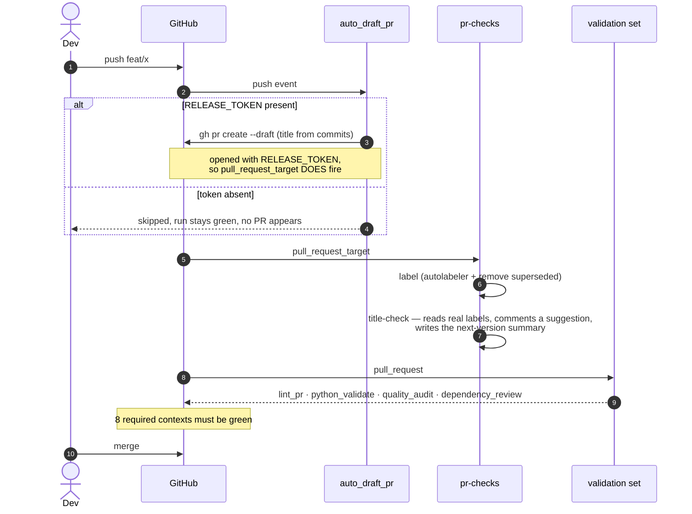
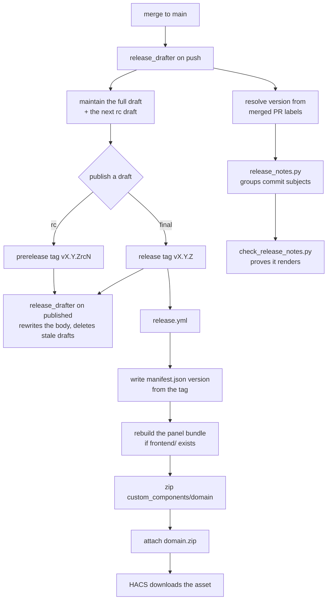

# The shipped workflow set — evidence for review

Repo-local. Describes `plugins/ha/skills/ha-integration/templates/.github/`, which is what a
scaffolded integration inherits. Built by reading all twelve workflow files, not from the
prose that describes them — several claims in that prose turned out to be wrong.

**This is evidence, not a verdict.** The review it supports asks two questions of every
workflow, and both have to be answered before anything is kept: *does the set as a whole
achieve what we intend*, and *is this workflow individually correct and worth shipping*.

---

## What the set is trying to do

Read off the workflows themselves, four jobs of work:

1. **Decide the version without anyone typing it** — labels on merged PRs resolve a semver
   bump; the release tag writes it into `manifest.json` at publish.
2. **Make the release notes from commit subjects**, not PR bodies, and prove they render.
3. **Refuse a merge that breaks the integration** — lint, types, tests, HACS, hassfest, and
   conformance to this skill.
4. **Remove typing from the loop** — the PR title comes from the commits, the draft PR opens
   itself, the release draft maintains itself.

Everything below should be judged against those four. A workflow that serves none of them is
a candidate for removal regardless of whether it works.

---

## Evidence table

`Context` is the check-run name GitHub sees — the string a ruleset must match.
`Required` means the name appears in `templates/ruleset.json`.

| Workflow | Trigger | Context (job name) | Required | Permissions | Depends on | On failure |
|---|---|---|---|---|---|---|
| `pr-checks.yml` · `label` | `pull_request_target` (opened, reopened, synchronize, edited) | `CC labelling` | ✅ | `contents: read`, `pull-requests: write` | autolabeler action, `gh` | PR unlabelled → no release category |
| `pr-checks.yml` · `title-check` | same, `needs: label` | `CC label validation` | ✅ **the gate** | inherited | `scripts/commit_summary.py`, `scripts/manifest_gate.py --suggest` | red when the label ≠ what the commits entitle the PR to |
| `lint_pr.yml` | `pull_request_target` | `CC title validation` | ✅ | `pull-requests: read` | `amannn/action-semantic-pull-request` | red until the title uses one of ten types |
| `python_validate.yml` | `push: main`, `pull_request` | `Ruff, Pyright and Pytest` | ✅ | `contents: read` | `requirements.test.txt` | red on lint, type or test failure; **warns only** when `tests/` is absent |
| `quality_audit.yml` | `push: main`, `pull_request` | `ha-integration conformance check` | ✅ | `contents: read` | `skill_audit.py`, `version_sync.py` | red on any audit FAIL |
| `hacs_validate.yml` | `push: main`, `pull_request`, daily cron | `HACS validation` | ✅ | `contents: read` | `hacs/action@main` (mutable) | red on any of nine HACS checks |
| `hassfest_validate.yml` | `push: main`, `pull_request`, daily cron | `Hassfest manifest validation` | ✅ | `contents: read` | `home-assistant/actions/hassfest@master` (mutable) | red on manifest/quality-scale violation |
| `dependency_review.yml` | `pull_request` | `Dependency review` | ✅ | `contents: read` | dependency graph **enabled** | red at `high` severity; **permanently red if the graph is off** |
| `panel_bundle.yml` | push/PR, **path-filtered** | `Panel type-check and tests` | ❌ can't be | `contents: read` | `frontend/`, npm | red on a type error or a failing panel test |
| `auto_draft_pr.yml` | `push` to any branch but `main` | `Auto draft PR` | ❌ not a check | `contents: read` | `RELEASE_TOKEN`, `commit_summary.py` | no-op without the token; what it emits is `reference/github-setup.md` |
| `release_drafter.yml` | `push: main`, `release: published` | `Auto draft releases` | ❌ not a check | `contents: write`, `pull-requests: write` | `release_notes.py`, `check_release_notes.py` | red on the release path only |
| `release.yml` | `release: published` | `Auto release zip` | ❌ not a check | `contents: write` | npm, when `frontend/` exists | red → HACS install fails with `Could not download` |
| `issue_stale.yml` | weekly cron, `workflow_dispatch` | `Mark stale` | ❌ not a check | `issues: write`, `pull-requests: write` | none | labels only; never closes |

---

## How they relate

Green is a required context; grey is not; purple is a shipped script the workflow cannot run
without. **Three workflows depend on `scripts/`** — that is why `scripts/` is not optional in
a scaffold, and why a stale copy of one script breaks CI in a way the workflow file alone
does not explain.

---

## The PR path, end to end

## The release path

The tag is the only place a version is written by hand, and it is written once, by a human
publishing a draft.

---

## What the set-level review has to resolve

These are the couplings and gaps a per-workflow read cannot settle. Each is verified against
the files above.

1. ~~**A required check that cannot go red.**~~ **Resolved.** `title-check` now compares the
   label the PR carries against the one its *commits* entitle it to (`commit_summary.py
   --mode label`) and exits 1 on a mismatch. A label being present was never the question —
   a `fix:`-titled PR carrying a `feat!:` commit was labelled `fix`, filed under Fixes and
   resolved a patch bump for a breaking change, and nothing objected. This also subsumes the
   breaking-marker check that item 6 stranded. `CC label validation` is **the** gate;
   `CC title validation` and `CC labelling` are automation that informs.
2. ~~**Two mutable action refs are required contexts.**~~ **Resolved — intended, and the
   pin loop is closed elsewhere.** `hacs/action@main` and `hassfest@master` are deliberately
   unpinned so they track upstream rules; they have no version, so Dependabot can never bump
   them and the daily cron is the mechanism that finds an upstream break before a PR does.
   For everything that *is* SHA-pinned: Dependabot scopes `directory: /`, which for the
   `github-actions` ecosystem means `/.github/workflows/` only — so a scaffolded repo's own
   workflows are bumped weekly, while `templates/` here is invisible to it. That is not a gap:
   Dependabot bumps this repo's copies, `check_template_pins` then fails because the shipped
   pins lag, and the sync is forced. Adding a second Dependabot directory for `templates/`
   was considered and rejected as redundant.
3. ~~**`dependency_review` is required and fails closed on a repo setting.**~~ **Resolved —
   the mitigation exists and is verified.** `bootstrap_repo.sh` enables the dependency graph
   over the API and prints an explicit fallback when it cannot. Checked against the testbed
   `PineappleEmperor/ha-ci-testing`: the graph is enabled and the SBOM endpoint answers. The
   red-check state the item describes was the pre-`bootstrap_repo.sh` condition, not a
   standing defect.
4. ~~**`auto_draft_pr` fails silently.**~~ **Resolved — it warns.** The missing-token branch
   emitted `::notice::` and exited 0, so a misconfigured repo looked identical to a healthy
   one. It now emits `::warning::`, which renders as an annotation on the run. The two other
   `::notice::` lines are left alone: "PR already open" and "no commits ahead" are normal
   outcomes, not misconfiguration. The job still exits 0 — this is an optional convenience,
   and failing it would redden every push for anyone without the token.
5. ~~**`release_drafter.yml` carries most of the set's complexity in one unrequired job.**~~
   **Resolved — the complexity is earned; stop revisiting it.** Read against the file's
   history, every element traces to a named fix: notes grouped by commit type `535048b`,
   render validation `e5f381e`, the generator that was never called `4c47ec8`, two writers
   racing `48d6cc4`, the previous tag including itself `06e8013`, measuring from the last
   full release `b1a56e1`, the first release with no previous tag `1fb2692`, version from
   merged PR labels `83edd54`, the rc draft `6ffdbcb`, and the `v0.1.0rc1rc1` suffix bug
   `1d1c0d5`. The rc machinery is deliberate — HACS users test candidates — and this
   marketplace repo already opted out of it for a documented reason. The residual risk is
   observability, covered by `check_release_notes.py` and by cutting an rc before a final.
6. ~~**`version-gate` runs on every PR and decides nothing.**~~ **Resolved — the job is
   deleted.** In a tag-driven repo the release tag writes the version at publish, so there was
   no committed bump to check and every comparison was skipped. Its one enforceable rule, that
   the title and commits agree about being breaking, sat inside the skipped block and never
   ran; that now lives in the label gate (item 1). The advisory "next release will be X"
   summary was worth keeping, so it is a step of `title-check` rather than a gate of its own,
   and the `Version validation` context went with the job.
7. ~~**`frontend_build` can never be required.**~~ **Resolved by moving the work.** The bundle
   rebuild now happens in `release.yml`, immediately before the zip is packed, so what users
   install is always a fresh build and no gate is needed to protect them. The renamed
   `panel_bundle.yml` keeps the PR-time type-check and tests and stays path-filtered and
   unrequired. The rebuild could not live in its own workflow: two workflows on the same
   `release: published` event cannot be ordered, so it could finish after the zip was packed.
8. **`issue_stale.yml` — kept, and renamed for what it does.** It is repo hygiene, which is an
   intent in its own right; the old name collided with "bundle staleness", which is unrelated.
9. ~~**`python_validate` warns instead of failing when `tests/` is absent.**~~ **Resolved —
   warning is the decision, not an oversight.** A scaffold legitimately starts without tests,
   and reddening its first PR would teach people to disable the check. `quality_audit` still
   hard-fails the moment a `quality_scale.yaml` rule claims `done` without a test behind it,
   which is where the claim actually has to be honest. The step already hard-fails when
   `tests/` exists but `requirements.test.txt` does not.
10. ~~**The GitHub-querying checks are inert in CI.**~~ **Resolved.** The audit step passes
    `GH_TOKEN: ${{ secrets.GITHUB_TOKEN }}`, and on the testbed's 2026-09-04 run the ruleset,
    live-context and dependency-graph checks all executed under it: the only warning the
    default token leaves is that it cannot list secrets, so `RELEASE_TOKEN` stays a
    maintainer-machine check.
11. ~~**End-to-end verification is outstanding.**~~ **Ran 2026-09-04, and found what reading
    could not.** `ha-ci-testing` #12 synced the current templates: the draft opener titled
    the PR from its commit, all eight required contexts reported green, and `panel_bundle.yml`
    failed on its first execution anywhere, twenty-four days after it was written — its own
    file in its path filter runs it once on a repo with no `frontend/`, where setup-node's
    cache step dies. Backlog rows 85-88 carry the finding and the process gap behind it: every
    check in this repo reads a workflow, none runs one, and a template this repo does not
    carry has no execution path at all. Merge, rc and final are the rest of the cycle.

---

## Still open

12. **`check_self_diff` waives three whole files.** `pr-checks.yml`, `release_drafter.yml` and
    `python_validate.yml` are exempt by name because they legitimately differ, so any
    *unintended* difference inside them is invisible. Narrowing the waiver from files to named
    jobs needs a per-job read of the three pairs first, to establish what legitimately differs.
